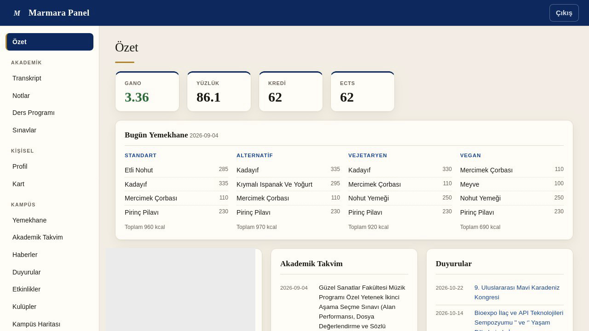

# marmara-cli

Unofficial, headless command-line client for Marmara Üniversitesi's student-facing
and public APIs. Prints JSON to stdout so it's easy to script or drive from an AI
agent, and it can also run as an [MCP](https://modelcontextprotocol.io) server so agents like Claude can call each operation as a tool.

> **Disclaimer.** This is a personal project. It is **not affiliated with,
> authorized by, or endorsed by Marmara Üniversitesi.** It talks to the same
> public/mobile endpoints the official app uses, with **your own** login
> credentials. Your password is never stored — only the returned tokens are
> cached locally in `~/.marmara/token.json` (permissions `0600`). Use at your own
> risk, and only with your own account.

## Build

Requires Go 1.24+.

```sh
go build -o marmara ./cmd/marmara     # or marmara.exe on Windows
```

## Usage

Public data needs no login:

```sh
marmara cafeteria          # daily cafeteria menu
marmara clubs              # student clubs
marmara club-events        # upcoming club events
marmara calendar           # academic calendar / exam periods
marmara campus-maps        # campus GPS markers (--types for categories)
marmara news               # university news
marmara announcements      # official announcements
marmara events             # university events
marmara features           # app feature toggles
marmara risk-report        # health/risk report
```

Your own data needs a login first. Students log in with an **`o` prefix before
the student number** (e.g. `o111111111`), the same as BYS — the plain number
alone won't work.

```sh
marmara login              # prompts for username/password (masked)
# or non-interactive, for scripts/agents:
MARMARA_USERNAME=... MARMARA_PASSWORD=... marmara login

marmara profile            # your profile
marmara card               # campus card status + numbers
marmara grades             # grade list
marmara grades detail --ders-id <OgrenciDersId>
marmara transcript
marmara schedule           # weekly timetable (--table supported)
marmara exams              # exam schedule

marmara logout             # revoke token + clear cache
```

Output formatting:

- default: compact JSON on one line (easy for scripts/agents to parse)
- `--pretty`: indented JSON
- `--table`: human-readable table for supported commands (`transcript`, `grades`,
  `schedule`, `cafeteria`, `card`, `profile`, `news`, `announcements`, `events`, `calendar`);
  any command without a table view falls back to JSON automatically

Example:

```
$ marmara transcript --table
AD SOYAD (111111111) — Bilgisayar Mühendisliği
GANO 3.36  |  86.1/100  |  62 kredi / 62 ECTS tamamlandı

2025 Güz — YANO 3.30 (GANO 3.30)
Kod      Ders                              Kr  ECTS  Harf  Not
BLM1001  Bilgisayar Mühendisliğine Giriş   4   4     AA    93
...
```

The access token auto-refreshes when it's expired or near expiry, using the
cached refresh token, so you rarely need to log in again.

## Web dashboard

A local, self-hosted browser UI over the same API layer — a clean dashboard for
your transcript, grades, schedule, exams, cafeteria menu, calendar, news and
more, plus a summary landing screen (GANO, today's menu, upcoming exams).

<p align="center">
  
</p>

```sh
marmara serve --open        # starts on http://127.0.0.1:8080 and opens a browser
marmara serve --port 9000   # pick a different port
```

Binds to localhost only. If you already logged in via the CLI, the dashboard uses
the same cached token; otherwise it shows a login form. Your password is sent only
to the local server and never stored — only tokens are cached, exactly like CLI
login.

## MCP server (AI agents)

Run the binary in MCP mode over stdio:

```sh
marmara mcp
```

Register it with an MCP-aware client. For Claude Code:

```sh
claude mcp add marmara -- /full/path/to/marmara mcp
```

Every read command above is exposed as a tool (`profile`, `grades`, `schedule`,
`exams`, `cafeteria`, `calendar`, …). Log in once with `marmara login` first; the
MCP server reuses the same cached token.

## Scope

Included: the native mobile Bearer API for your own academic data (profile, card,
grades, transcript, schedule, exams) and genuinely public JSON (cafeteria,
clubs, calendar, campus maps, news, announcements, events).

Deliberately excluded: anything that isn't a student's own data or a public
endpoint, and any cross-student lookup — calls always act as the authenticated
user and never take an arbitrary student ID.

## Roadmap / TODO

- **Table output for `exams`.** Exam endpoints return empty arrays between terms,
  so the real field names aren't confirmed yet. Once exam schedules are active,
  add a typed `--table` renderer based on the actual `OgrenciDersSinavListesi` shape.

### Removed — broken or gone upstream

These were dropped because the university endpoints are unreliable or changed;
they can be revisited if the backends stabilize:

- **Personnel directory** (`RehberBilgileri`) — returns a server-side HTTP 500 on
  any real query; the required request shape is unknown and even valid-looking
  bodies throw.
- **AVESİS search** (`/proxy/search`) — now 404; the JSON search API path was
  removed or moved.
- **Support tickets** (Destek) — `GetApplicationAttributes` redirects to a web
  login (GET) or demands an application GUID we don't have (POST). Destek expects
  a browser web session, not this token-based client.

## License

MIT — see [LICENSE](LICENSE).
